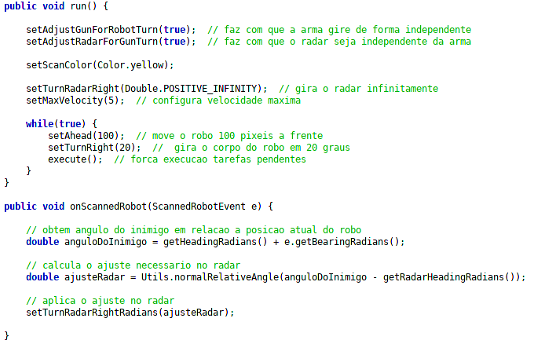
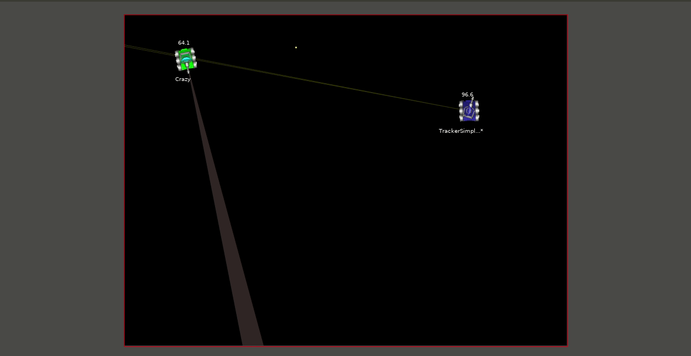
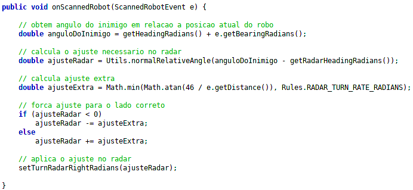
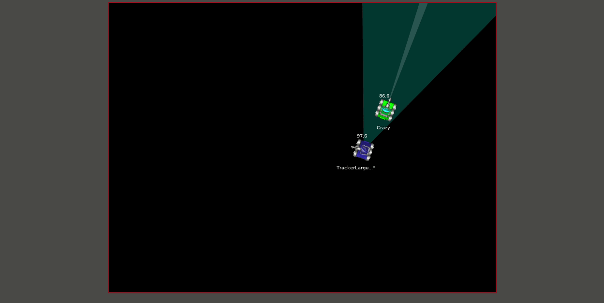

# Aprendendo a utilizar o radar

Saber utilizar bem o radar é crucial para batalhas **1 vs 1** e 
**melee**. As motivações são bem claras, manter o oponente sob o radar
implica em saber a todo instante **onde ele está**, **para onde está indo**, **a energia atual**, e outras informações que podem ser obtidas
através da [API](http://robocode.sourceforge.net/docs/robocode/).

## Técnicas para travas o radar em um oponente

Felizmente, travar o radar no oponente é em geral uma tarefa simples e com
poucas linhas de código (e um pouco de conhecimento de trigonometria), vamos criar um algoritmo simples e que já pode ser um bom início para a tarefa de **tracking** (manter as ações do oponente sob o radar).

### O tracking mais básico

O primeiro algoritmo consiste em inicialmente girar o scan o máximo possível para uma única direção, ao detecar um robo no radar, basta ajustar o angulo do radar no sentido contrário ao que ele estava indo.

Veja um exemplo:

Note que fazer o radar girar de forma independente da arma é essencial, além disso precisamos desenvolver o robo herdando o comportamento de um **AdvancedRobot**, pois assim conseguimos realizar ações paralelamente uma a outra. O resultado segue:

Todavia, o tracker simples pode vir a perder de vista o oponente em alguns casos, e para corrigir isto um pequeno ajuste extra na largura do scan pode auxiliar.

A ideia agora consiste em forçar um ajuste maior no scan, ou seja, se estamos ajustando a esquerda, forçamos o radar a ir ainda mais a esquerda, se estamos ajustando a direita, forçamos o radar a ir ainda mais a direita.

Isto vai fazer com que o oponente sempre fique em uma zona de nosso radar, a formula que podemos utilizar para calcular este ajuste extra não é tão complexa é feita da seguinte maneira:

O resultado fica do seguinte modo:

